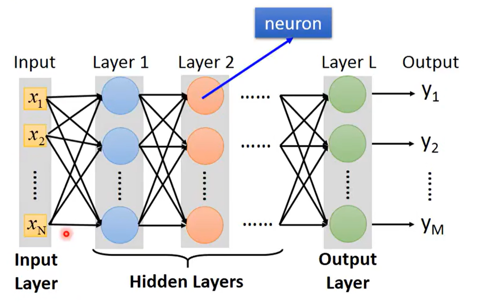

# 机器学习：

就目前看到的部分，机器学习的流程主要有以下三个：

1、找到一个函数，预测值y = ƒ(X)

2、定义损失函数L

3、优化参数

##  1.Funtion with Unknow Parameters

​	视频中主要介绍了两种函数构建方法，x为输入，y为预测值。

​	Linear的方法：
$$
y = b + wx/b+\sum_j{w_jx_j}
$$

​	sigmoid加总的方法（没看到名字）：
$$
y = b + \sum_{i}c_i*sigmoid(b_i+w_i*x)/y= b+\sum_{i}c_i*sigmoid(b_i+\sum_j{w_{ij}*x_j})
$$
​	其中xj表示多个数据输入，例如：前一天的观影人数x1到前七天的x7。另外，视频结尾处还提及了ReLU的方法，用c*max(0, b + wx)代替sigmoid函数，加总来模拟预测曲线。

##  2.Define Loss from Training Data

​	损失函数用于评价函数的好坏，也即是参数c、w、b设置的是否成功。

​	现目前的视频中主要介绍了MAE（mean absolute error，绝对平均误差）和MSE（mean square error，方差）两种，算取预测值y和实际值ŷ的误差，L的值越小越好。

##  3.Optimization

​	优化参数的部分主要使用gradient decent（梯度下降）的方法来找损失函数的最小值，比如对参数w的优化：
$$
w^{i+1} = w^{i} -ŋ* \frac{∂L}{∂w}|_{W= W^i}
$$
​	其中的超参数 ŋ决定学习速率，需要自己设置。

​	在实际的训练过程中，将整个数据集随机分为多个batch，每个batch依次产生损失值Li，用于下一个batch的参数优化，以减少计算难度。

# 深度学习

​	深度学习的流程与机器学习三步骤相似，只不过第一步不再是寻找一个函数：

1、寻找一个神经网络或者说一组函数。

2、评价这一组函数的好坏（还是使用的损失函数）

3、优化参数


## 1.define a set of function

​	相较于机器学习而言，b + Σwx不再是生成预测值，而是其中的一个节点（neuron），输出可能会用于进一步的计算，变成下一个b + Σwx的输入，输入x相同的b + Σwx，处在同一层，称之为一个layer。经过一层层输出的传递，最后得到预测值。
$$
y = σ(W^L....σ(σ(W^1*X+b^1)+b^2)...+b^L)
$$
​	其中W表示参数矩阵，b表示常数向量，X为输入向量，σ（WX+b）的输出作为下一层的输入向量，最后得到预测值y。



## 2.goodness of function

​	深度学习的损失函数还是和机器学习的一样，都是计算预测值y和实际值ŷ的差值，例如计算手写数字预测时的损失函数：
$$
C(y,ŷ) = -\sum_{i=1}^{10}ŷ_ilny_i
$$

## 3.pick the best function

​	深度学习的参数更新原理和机器学习一样，都是用梯度下降的方法来进行参数更新，但是因为深度学习分为多个层次，每层有多个参数，所有参数过多，直接计算每一个参数的梯度难度很大，所以在计算每个参数的梯度时，根据微分中的链式法则，使用反向传播的方式，从最后一层依次向前递推每一层参数的梯度。

# 代码模块 

模型训练大致流程

```python
dataset = MyDataset(file)							#读取数据

dataloader = DataLoader(dataset, batch_size, shuffle=True)	#划分batch，仅在training时shuffle为true，让batch生产随机

model = MyModel().to(device)						#使用GPU/CPU

criterion = nn.MSELoss()							#设置损失函数

optimizer = torch.optim.SGD(model.parameters(), 0.1)#设置优化算法、需要优化的参数、学习速率ŋ


#training
for epoch in range(n_epochs):						#训练次数
    model.train()									#训练模式
    
    #一个epoch
    for x, y in dataloader:								
        optimizer.zero_grad()						#梯度归零
        x, y = x.to(device), y.to(device)			
        pred = model(x)								
        loss = criterion(pred, y)					
        loss.backward()
        optimizer.step()							#更新参数，完成一个update
```

Validation Loop和Testing Loop则需要更改为evaluation mode（model.eval()），并用with torch.no_grad():关闭梯度计算。


数据的输入和batch划分

```python
class MyDataset(Dataset):
    def __init__(self, file):
        self.data = 					#输入数据
        
    def __getitem__(self, index):
        return self.data[index]			#返回指定的一条数据，主要在DataLoader(dataset, batch_size, shuffle=True)函数中使用
    
    def __len__(self):
        return len(self.data)			#返回数据条数，用于划分出具体的batch数量
```

大致的模型构建

```python
class MyModel(nn.Module):
    def __init__(self):
        super(Mymodel, self).__init__()
        self.net = nn.Sequential(
            nn.Linear(10, 32)	,#layer1
            nn.Sigmoid(),	#layer1
            nn.Linear(32,1)	#layer3
        )

def forward(self, x):
    return self.net(x)
```

