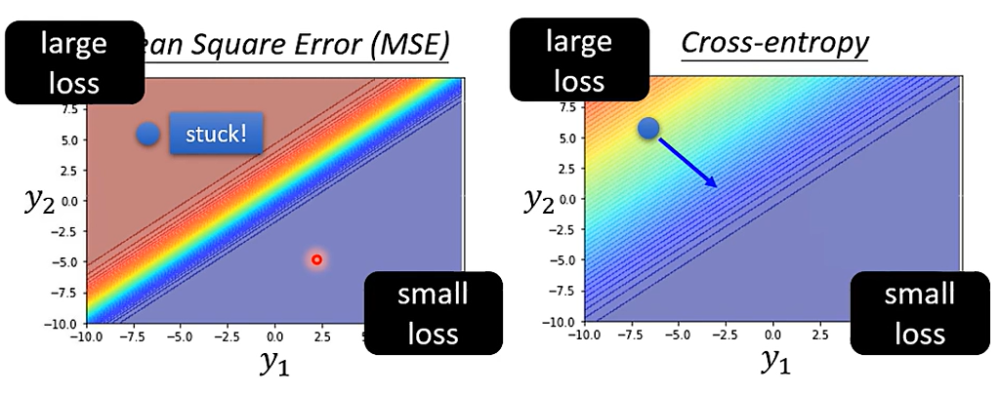

training过程中可能遇到的问题：

### 1、model bias

​		模型设置的太简单，导致training 时loss很大，比如 y = b + wx很难预测一个周期性的观影人数。

解决方法：增加feature，或者使用deeplearning，用更多的neuron或者layer，

### 2、Optimization Issue

​		optimization存在问题，没有找到loss真正最小的地方（saddle point或者振荡），model bais和optimization issue可以通过对function和更简单模型进行比较辨别，Hidden Layers层数更多，但是loss更大，这就是optimization issue

#### （1）saddle point（鞍点）

training过程中，g（gradient） = 0时，可能存在两种情况：
$$
L(θ) ≈ L(θ') + (θ - θ')^Tg+\frac{1}{2}(θ - θ')^TH(θ - θ')/or(v^THv)
$$
​		H（Hessian），Hij是对第i项和第j项先后求偏导。

​		H的特征值全为正，则为Local minima，

​		H的特征值全为负，则为Local maxima，

​		有正有负，则为saddle point。

​		（H = $P^T ⋀  P$ ，只要最后⋀中全为正或者全为负，则$v^THv$一定为正或负，可以确定$L(θ)$和$L(θ')$的大小关系，saddle point下则有正有负，$L(θ)$和$L(θ')$的大小关系就不确定了)

##### 解决方法：

​		选择特征值为负的特征向量，加入到θ-θ'中，向这个方向更新参数可以减小Loss（实际上不太常用这个方法来防止saddle point，而且参数维度越高，计算也更加困难，local minima一般也很少，很多时候都是train到saddle point）。

#### （2）momentum

​		考虑到saddle point和local minima的情况，想找到最小的Loss，因此在training的过程中加入momentum，在进行参数更新时，加入前一步参数更新的动量，在training时，不至于停留在saddle point或是陷入一个local minima。

​		具体表现为$m^{t+1} = λm^t-ŋg^t$，$θ^{t+1} = θ^t + m^{t+1}$。

（根据batch的大小一次update和epoch的时间有一定差异，batch越小，一般一次epoch的时间越长，update的次数越多，training和testing的效果也一般更好。）

#### （3）Adaptive Learining Rate

​		在此前的机器学习中，ŋ（学习速率）的设定是不变的，但是存在ŋ太大，参数更新后Loss的数值在一个峡谷两侧振荡，Loss的值稳定了，但是gradient还是没降下来。

​		因此加入了σ（Adagrad），新的参数更新方式：$θ^{t+1}_i = θ^t_i - \frac{ŋ}{σ^t_i}g^t_i$，$σ^t_i = \sqrt{\frac{1}{t+1}\sum_{n= 1}^t ({g^n_i})^2}$，ŋ的大小就可以根据当前的gradient，相较于前一步update时进行调整。（下降速度变大，坡度越大，gradient变大，ŋ变小，下降速度变小，坡度越小，gradient变小，ŋ变大，更容易快速的靠近Local minima，但是这个方法因为每一个gradient的作用都一样，之前的gradient可能会影响后续的更新）

​		RMSProp，对以上方法进行调整，$σ^t_i = \sqrt{α(σ^{t-1}_i)^2 +(1-α)(g^t_i)^2}$，用α来设定新的gradient的重要性，可以通过设置这个值来控制学习速率的变化速度。

​		Adam就是RMSProp+Momentum。

​		另外，为了减少历史中的gradient的影响，在training过程中，ŋ需要根据时间进行调整：

​		①Learining Rate Decay：ŋ随着训练的时间增加而减小

​		②Warm up：ŋ随着训练时间的增加而先增大后减小（可能是因为开始的σ能够表示的统计数据较少，所以需要先控制较小的ŋ）

#### （4）Loss of Classification

​		Classification时，输出有多个值（以此表示是某一类的可能性），因此过程中用到了Soft-max（$y_i' = \frac{exp(y_i)}{\sum{exp(y_j)}}$，将所有的结果归一化到0-1，和为1），Classification的ŷ一般用向量表示，来保证类与类之间等差，因为向量与值还是有所差异，Classification的Loss function使用的Cross-entropy（$e = -\sum{ŷ_ilny_i'}$，而不是用MSE（$\sum{(ŷ_i-y_i')^2}$。（因为使用MSE时，根据training中的y值大小，会导致y值很大时，形成一个很平坦的区域，造成训练卡住，无法得到真正的结果）

（minimizing cross-entropy = maximizing likehood）

### 3、Overfitting

​		training的loss很小，但是testing的loss很大，原因是function仅仅适用于训练集数据的预测，比如说function随机到了一个映射，training的loss就很小。

##### 解决方法：

1、增加训练资料，尽可能的涵盖所有的数据（但是很难获得这么多的数据

2、Data augmentation，对数据进行处理，创造新的数据，比如说把照片左右反转、放大（但是要合理

3、constrained model，减少参数或者共享参数、更少的feature、early stopping、regularization、dropout（需要根据问题的特性来设计，可能退化到model bias）

4、切分出Validation data，用Validation data模拟testing data，可以大致对模型性能有一个预测（切分方法：N-fold cross validation，training data切分为N份，每一份轮流作为Validation data，最后取平均的loss）

### 4、Mismatch

​		training data和testing data分布不同（特殊事件发生导致testing data有较大差别，比如说training data是动物照片，testing data是人画的比较抽象的动物图片）