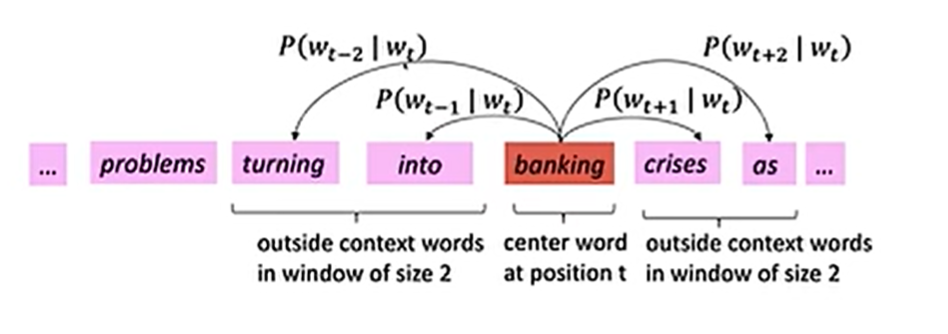
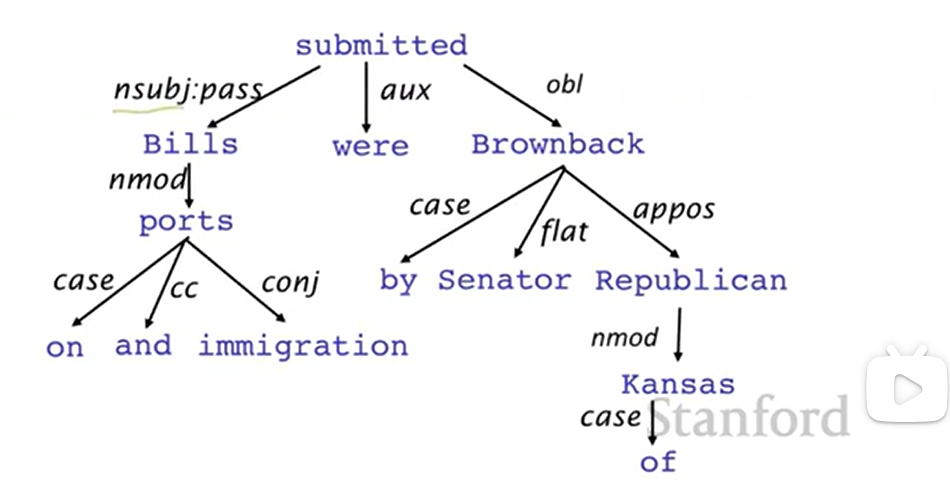
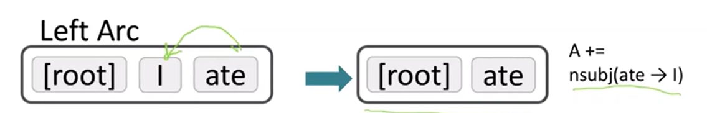
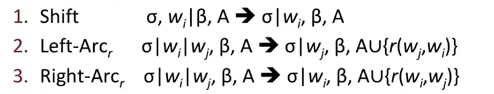
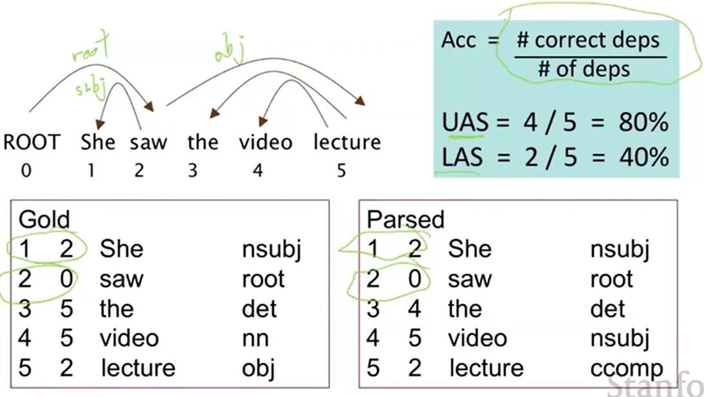
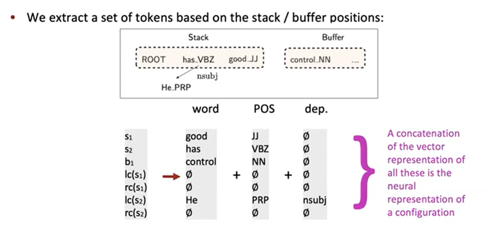
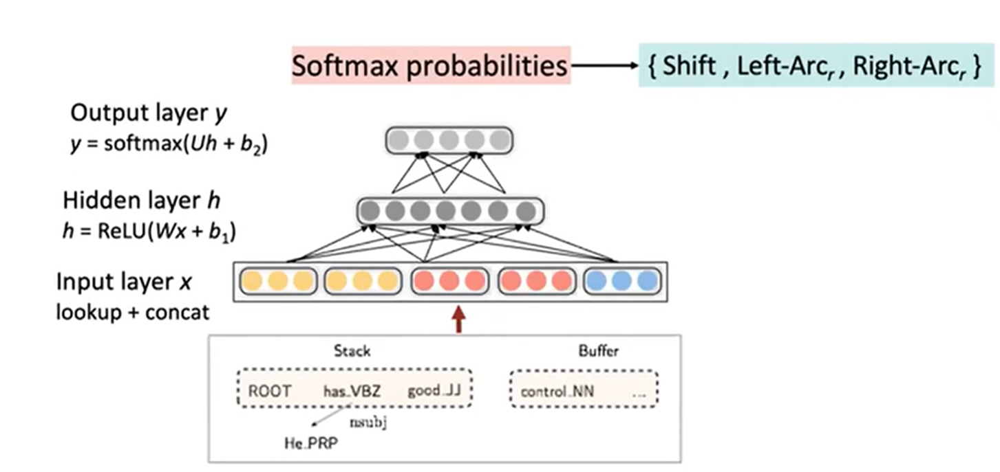
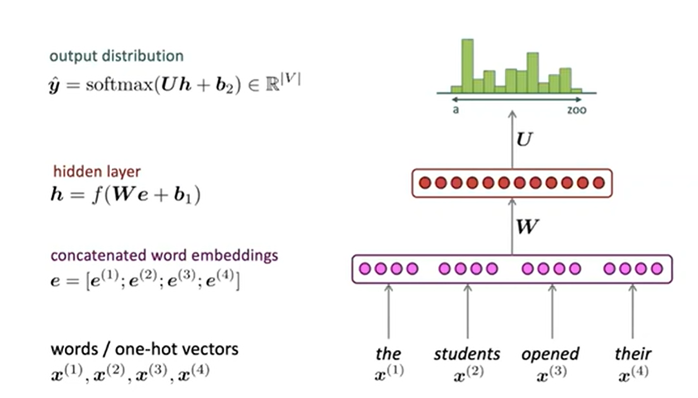
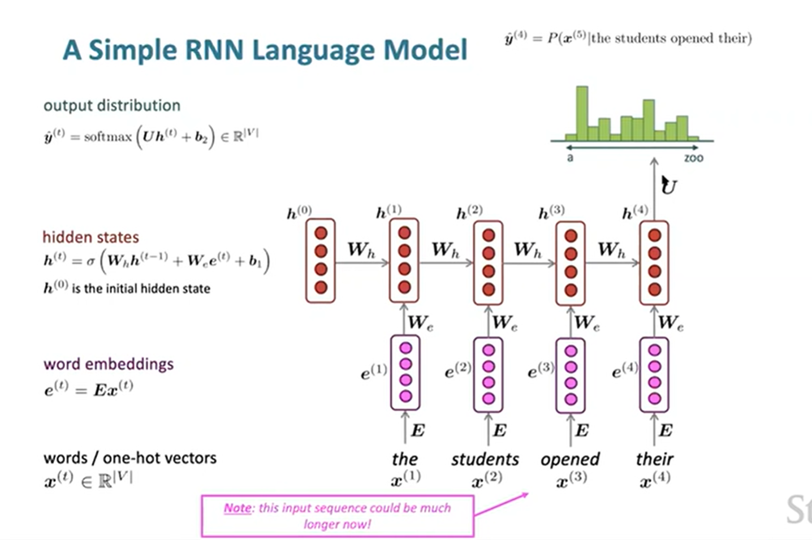

## Word2Vec

​		机器学习中传统的单词表示方法：one-hot vector，用一个向量来表示单词，向量的维度等于词库的单词数，但是这种表示方法存在部分问题：1、无法表示单词的意思，2、单词与单词之间向量正交，无法表示相似度，3、因为词库的单词数量一般很大，所以向量的维度容易过大。

​		Word2Vec则是类比于WordNet（一个单词的含义由它的同义词集合和下义词集合来定义），在有很大的文本库(corpus of text)情况下，按照设定的窗口大小，将句子分为中间的center word c及其周边的所有单词context words o，单词的相似度就用给定c的情况下o的条件概率来表示，然后不断的调整word vector使得这个概率最大化。每个单词用两个向量表示，一个是它作为center word时的向量$v_w$ 以及它作为context word时的向量 $u_w$。

​		在word2vec中，条件概率写作context word与center word的点乘形式再对其做softmax运算，即
$$
P(O = o | C = c) = \frac{exp(u^T_o*v_c)}{\sum_{w} {exp(u^T_w*v_c)}}
$$
​		而整体的似然率就可以写成这些条件概率的联乘积形式：
$$
L(θ) =\prod_{t = 1}^{T}\prod_{-m≤j≤m}P(W_{t+j}|W_t;θ)
$$
​		为方便计算损失函数，进而对此进行取对数运算：（负号用于将极大化似然率转化为极小化损失函数的等价问题）
$$
J(θ) = -\frac{1}{T}logL(θ) =-\frac{1}{T}\prod_{t = 1}^{T}\prod_{-m≤j≤m}logP(W_{t+j}|W_t;θ)
$$
​		最后使用梯度下降算法来逐步求得使目标函数最小的word vector的形式。

## Constituency Parsing

​		Constituency Parsing主要用phrase structure grammer即短语语法来不断的将词语整理成嵌套的组成成分，又被称为context-free grammers，简写做CFG。

​		其主要步骤是先对每个词做词性分析part of speech, 简称POS，然后再将其组成短语，再将短语不断递归构成更大的短语。

​		例如，对于 the cuddly cat by the door, 先做POS分析，the是限定词，用Det(Determiner)表示，cuddly是形容词，用Adj(Adjective)代表，cat和door是名词，用N(Noun)表示, by是介词，用P(Preposition)表示。

​		然后the cuddly cat构成名词短语NP(Noun Phrase)，这里由Det(the)+Adj(cuddly)+N(cat)构成，by the door构成介词短语PP(Preposition Phrase), 这里由P(by)+NP(the door)构成。

​		最后，整个短语the cuddly cat by the door 是NP，由NP（the cuddly cat）+ PP(by the door)构成。

​		此外还有动词短语VP，最后一整段句子由多个NP、VP构成。

## Dependency Grammar and Dependency Structure 

​		为了更好的理解句子中词与词之间的关系，于是采用了Dependency Structure展示词语之间的依赖关系，其中的箭头表示其依存关系以及部分语法关系。

​		Dependency tree便是其中的一种表示方式：

​		Dependency Parsing可以看做是给定输入句子$S = w_0w_1...w_n$（其中 $w_0$ 常常是fake ROOT，使得句子中每一个词都依赖于另一个节点）构建对应的Dependency tree的任务。

## Methods of Dependency Parsing

#### Transition-based Dependency Parsing

​		Transition-based Dependency Parsing是构建依赖关系解析器的一个常用的方法，可以看做是state machine（状态机），对于输入的句子$S=w_0w_1...w_n$，state由三部分构成 (σ,β,A) 。

​		σ 是 S 中若干 wi 构成的stack。

​		β 是 S 中若干 wi 构成的buffer。

​		A 是dependency arc 构成的集合，每一条边的形式是$(wi,r,wj)$，其中r描述了节点的依存关系如动宾关系等，具体如下：

​		初始状态时， $σ = [ROOT(一般是w_0)], β = w_1, ..., w_n, A = ϕ$。而需要达成的最终目标是$σ = [w], β = ϕ$，而 A 包含了所有的dependency arc， A 就是我们想要的描述Dependency的结果。

state之间的transition有三类：

​		Shift：将buffer中的第一个词移出并放到stack上。

​		Left-Arc：将$(w_j,r,w_i)$加入边的集合 A ，其中 wi 是stack上的次顶层的词， wj 是stack上的最顶层的词。

​		Right-Arc:将$(w_i,r,w_j)$加入边的集合 A ，其中 wi 是stack上的次顶层的词， wj 是stack上的最顶层的词。

​		然后不断的进行上述三类操作，直到从初始态达到最终目标。在每个状态下如何选择哪种操作呢？当我们考虑到Left-Arc与Right-Arc:各有|R|（|R|为r的类的个数）种class，我们可以将其看做是class数为2|R|+1的分类问题，可以用SVM等传统机器学习方法解决。

## Evaluation of Dependency Parsing

​		当有了Dependency Parsing的模型后，对其准确性进行评估一般有两个方法，一个是LAS（labeled attachment score）即只有arc的箭头方向以及语法关系均正确时才算正确，以及UAS（unlabeled attachment score）即只要arc的箭头方向正确即可。

​		一个具体的例子如下图所示：

## Neural Dependency Parsing

​		传统的Transition-based Dependency Parsing对feature engineering要求较高，主要使用神经网络来减少human labor。

​		对于Neural Dependency Parser，其输入特征通常包含三种：

​		1、stack和buffer中的单词及其dependent word。

​		2、单词的Part-of-Speech tag。

​		3、描述语法关系的arc label。

​		然后将其转换为embedding vector并将它们联结起来作为输入层，再经过若干非线性的隐藏层，最后加入softmax layer得到每个class的概率。

## Language Model

​		语言模型研究的是根据已知序列推测下一个单词的问题，即假设已知 $x(1),x(2),...,x(t)$，预测下一个词 $x^(t+1)$的概率$P(x(t+1)|x(t),...,x(1))$的问题。根据条件概率的链式法则，我们也可以将其看做一系列词出现的概率问题$P(x(t),...,x(1))=\prod_{t=1}^TP(x(t)|x(t−1),...,x(1))$

​		语言模型应用广泛，比如手机上打字可以智能预测下一个你要打的词是什么，或者谷歌搜索时自动填充问题等都属于语言模型的应用。语言模型是很多涉及到产生文字或预测文字概率的NLP问题的组成部分，如语音识别、手写文字识别、自动纠错、机器翻译等等。

#### n-gram Model

​		较为经典的语言模型是n-gram模型。n-gram的定义就是连续的n个单词。例如对于 the students opened their __这句话，unigram就是"the", "students", "opened", "their", bigram就是"the students", "students opened", "opened their", 3-gram就是" the students opened ", " students opened their"， 以此类推。该模型的核心思想是n-gram的概率应正比于其出现的频率，并且假设 P(x(t+1)) 仅仅依赖于它之前的n-1个单词，即
$$
P(x(t+1)|x(t),...,x(1)) = P(x(t+1)|x(t),...,x(t-n+2)) = \frac{P(x(t+1), x(t),...,x(t-n+2))}{P(x(t),...,x(t-n+2))}≈\frac{count(x(t+1),x(t),...,x(t-n+2))}{count(x(t),...,x(t-n+2))}
$$
​		其中count是通过处理大量文本对相应的n-gram出现次数计数得到的。

​		n-gram模型主要有两大问题：

​		1、稀疏问题 Sparsity Problem。在我们之前的大量文本中，可能分子或分母的组合没有出现过，则其计数为零。并且随着n的增大，稀疏性更严重。

​		2、我们必须存储所有的n-gram对应的计数，随着n的增大，模型存储量也会增大。

​		这些限制了n的大小，但如果n过小，则我们无法体现稍微远一些的词语对当前词语的影响，这会极大的限制处理语言问题中很多需要依赖相对长程的上文来推测当前单词的任务的能力。

## Window-based DNN

​		一个自然的将神经网络应用到语言模型中的思路是window-based DNN，即将定长窗口中的word embedding连在一起，将其经过神经网络做对下一个单词的分类预测，其类的个数为语裤中的词汇量，如下图所示：

​		与n-gram模型相比较，它解决了稀疏问题与存储问题，但它仍然存在一些问题：窗口大小固定，扩大窗口会使矩阵W变大，且 x(1),x(2) 与W的不同列相乘，没有任何可共享的参数。

## RNN Language Model

​		因为RNN在每个hidden Layer输出时，不仅传输到下一层，结果还会被存在memory的特性，可以通过不断的应用同一个矩阵W实现参数的有效共享，并且没有固定窗口的限制，即前一时刻的隐藏层状态以及当前的输入通过矩阵W加权求和然后在对其非线性变换并利用softmax得到对应的输出，对于语言模型，RNN的应用如下所示，即对word embedding vector进行如上操作：

​		与之前的模型相比，RNN模型的优势是：

​		1、可以处理任意长度的输入。

​		2、理论上t时刻可以利用之前很早的历史信息。

​		3、对于长的输入序列，模型大小并不增加。

​		4、每一时刻都采用相同的权重矩阵，有效的进行了参数共享。

​		其劣势是：

​		1、由于需要顺序计算而不是并行计算，RNN计算较慢。

​		2、实际上由于梯度消失等问题距离较远的早期历史信息难以捕捉。

## Pretraining

#### Byte-pair encoding

