## Question Answering

​		早期问答系统的建立是为了创造一个可以理解人类语言，并对问题进行解答的系统，现在则主要关注如何在一个庞大的数据库上建立问答系统以回答更多的问题。

##### Reading Comprehension

​		Reading Comprehension，也即是阅读理解，比如说从一段文字中找出一个相关问题的答案，可以用于评估模型对人类语言的理解能力。

##### BiDAF: the Bidirectional Attention Flow model

​		BiDAF就是一个曾经最流行的Reading Comprehension模型。

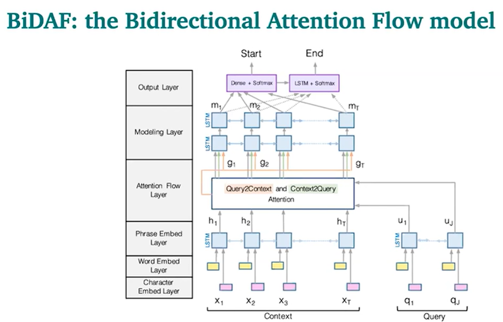

​		多年来，BiDAF architecture有许多变体和改进，但其核心思想是Attention Flow layer，attention 应该双向流动——从上下文到问题，从问题到上下文。令相似矩阵 ( w 的维数为 6d)。
$$
S_{ij} = w_{sim}^T[c_i; q_i; c_i∘q_i]∈R
$$
​		Context-to-Question (C2Q) 注意力 (哪些查询词与每个上下文词最相关)
$$
α^i = softmax(S_{i,:})∈R^M\qquad∀i∈{1,...,N}
$$

$$
a^i = \sum_{j=1}^Mα_j^iq_j∈R^{2h}\qquad∀i∈{1,...,N}
$$

​		Question-to-Context (Q2C) 注意力 (上下文中最重要的单词相对于查询的加权和——通过 max 略有不对称，通过 max 取得上下文中的每个单词对于问题的相关度
$$
m_i = max_jS_{ij}∈R\qquad∀i∈{1,...,N}
$$

$$
β=softmax(m)∈R^N
$$

$$
c' = \sum_{i=1}^Nβ_ic_i∈R^{2h}
$$

​		最后的output则是：
$$
g_i = [c_i;a_i;c_i⊙a_i;c_i⊙b_i]
$$
​		modelling层则是将$g_i$传入一个双层 bi-directional LSTM。（与Attention Layer对问题和上下文之间进行交互不同的是，modelling Layer只对上下文进行交互）

​		Start：通过 BiDAF 和 modelling 的输出层连接到一个密集的全连接层然后 softmax。

​		End：把 modelling 的输出 M 通过另一个BiLSTM得到 M2，然后再与 BiDAF layer 连接，并通过密集的全连接层和 softmax。

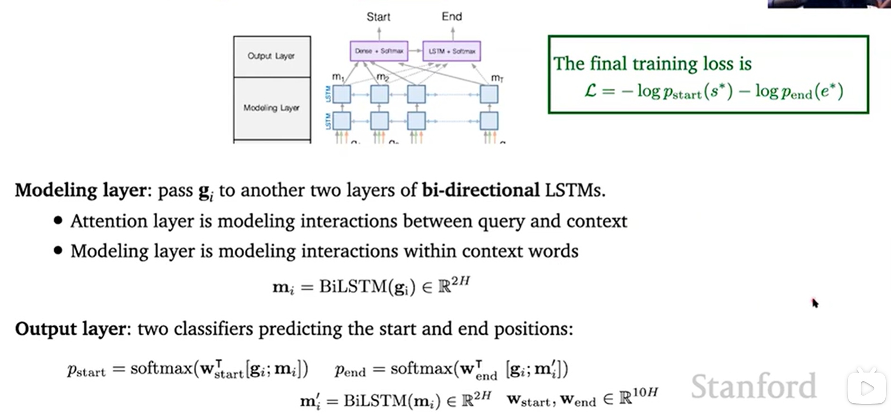

##### BERT for reading comprehension

​		BERT主要在两方面进行了预训练——Masked language model（MLM)和Nextsentence prediction（NSP），将BERT运用在阅读理解上主要通过将Question和Passgae各作为一段，输入到模型中，Answer作为预测。

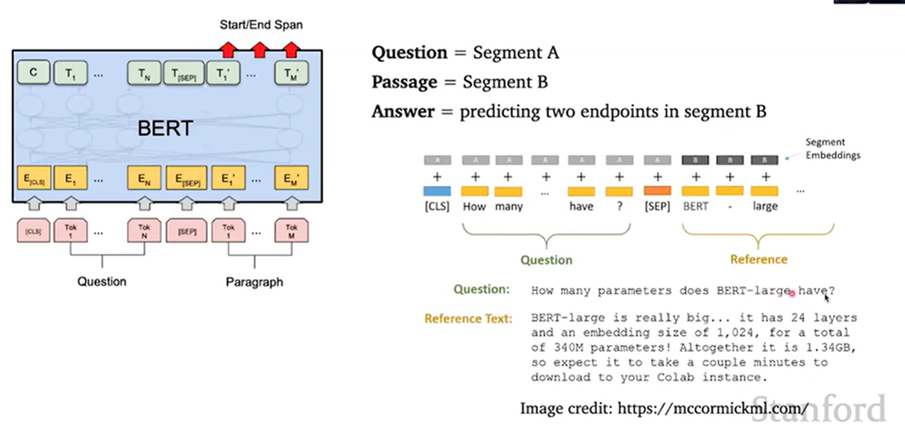

## NLG(Natural Language Generat)

​		NLG（自然语言生成）指的是可以完成生成新文本的任何任务，比如说机器翻译、摘要、写作等等。其基础就是利用输入的文本（Token，英文中的word piece，中文中的字），来生成新的文本，并在以新文本以及之前的，来生成文本（类似Decoding部分）

​		模型中的每一步即是计算每一个token的得分S，并计算对应的条件概率。
$$
P（y_t = w| {y_{<t}})=\frac{exp(S_w)}{\sum_{w'}exp(S_{w'})}
$$
​		然后再根据这个概率选择对应的token（一般使用的argmax，也即是选取概率最大的），也即是得到$y_t$。

​		损失函数则由以下函数表示：
$$
L_t = -logP(y_t^*|y_{<t}^*)
$$

##### Decoding from NLG models

​		 在选择输出新文本时，一般使用的argmax，这存在一个问题，也即是他无法表现人类的随机性，因此后续提出了Top-k sampling的方法，从概率最高的前k个token中随机选取一个单词，来模拟人类的随机性，但是这依然存在选多了或者选少了的问题（前面一两个概率极高或者大部分概率相近）。因此还有Top-p sampling的方法依据前面的概率合来选择。

​		另外还有softmax temperature的方法，在softmax函数中加入超参数温度T。
$$
P（y_t = w| {y_{<t}})=\frac{exp(S_w/T)}{\sum_{w'}exp(S_{w'}/T)}
$$
​		提高温度T：Pt变得更均匀，因此输出的概率分布更多样化 

​		降低温度T：Pt变得更尖锐，因此输出的多样性更少 

​		另外还可以引入外部信息来对概率分布进行纠正，比如re-balancing distributions，

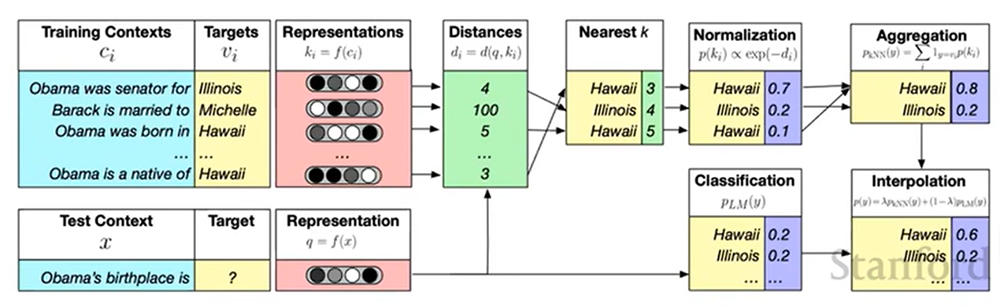

##### Training NLG models

​		因为原来的模型中一般使用的损失函数计算方法一般对单一化的结果有效一些，为了增加新文本生成的多样性，采用Unlikelihood的方法进行训练，

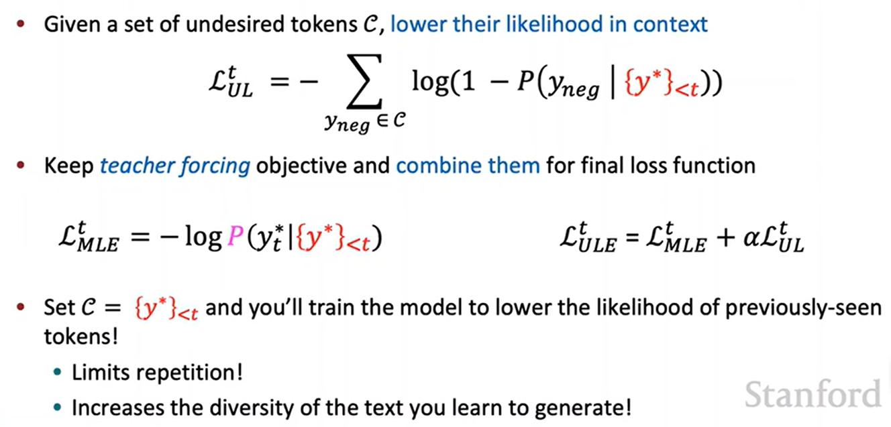

​		Unlikelihood的训练方法会降低曾经生成过的词汇的生成可能性，进而增加新词汇的生成，使得输出新文本更加多样性。

​		另一个方法就类似于Decoding中的，在training过程中，生成新文本后，产生下一个新文本时输入正确答案，testing时才输入上一步的输出。

##### Evalustion NLG system

​		评估NLG模型主要有Content Overlap Metrics、Model-based Metrics、以及人工评价。

​		ontent Overlap Metrics主要是计算两个句子之间的相似性，主要有之前学过的N-gram（因为只根据单词的相似性，结果出现偏差的可能性较高）和Semantic（生成语义的概念结构图，以此来计算语义的相似性，比较结果更好）的方法

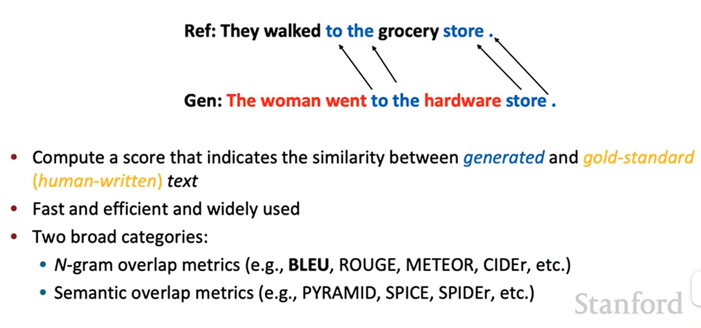

​		Model-based Metrics则使用单词和句子的学习表示来计算生成文本和参考文本之间的语义相似性。

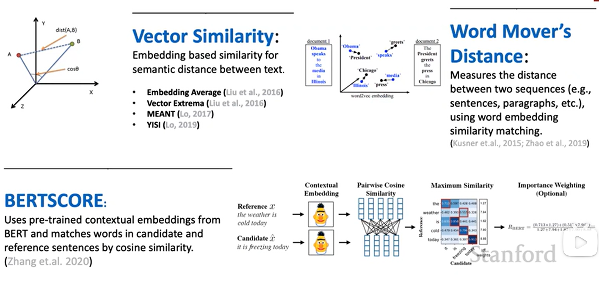

​		虽然有之前这些机器的评价方式，但是就文本理解来说，还是人类自身的理解能力更好一些，所以人工评价一般更好（但是可能存在一些主观的影响因素）

## Coreference Resolution

​		Coreference Resolution 共指消解，一种语言中的语法现象，表示句子中多个指示（mention）指代同一个世界中的实体的情况，比如说在一段一文中，出现了A和B，文中的he/she可能代指的是其中的哪一个，也即是将文中的mention和人物、物体等想关联。现在主要有四种构建方式，Rule-based、Mention Pair、Mention Ranking以及Clustering。

##### Rule-based

​		Rule-based主要是Hobbs的naive algorithm，主要思想就是对语句进行结构的分析，然后用树状图去得到coreference关系，主要步骤如下：

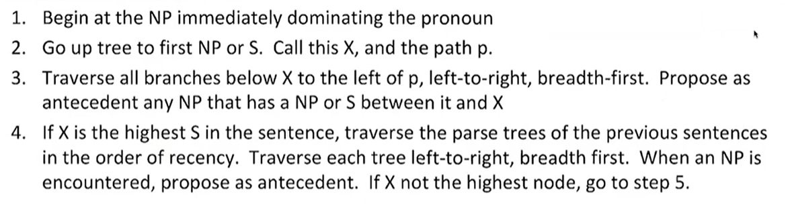

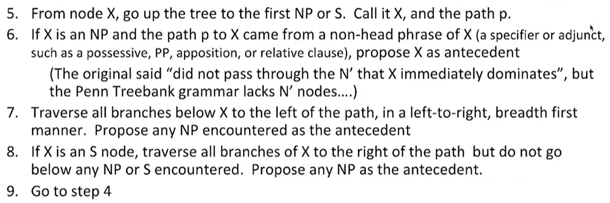

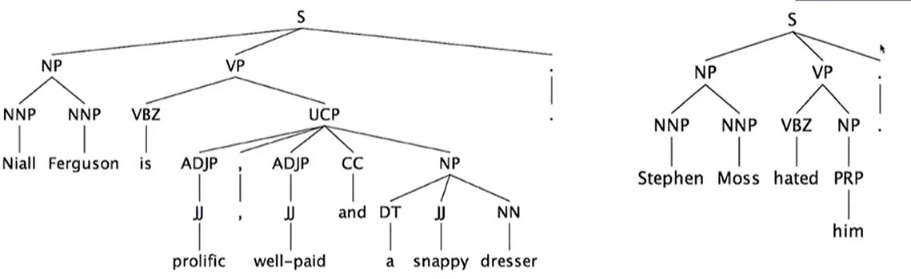

​		但是该方法存在一定缺陷，可能两个句子的结构相同，但是指代不同，比如以下句子中的it，指代的东西就不相同。

##### Mention Pair

​		Mention Pair的目的是，将metion从句子中抽出来分类，然后训练一个二输入的二分类，输入mention对P(mi, mj)，判断这个mention对是否为正常的mention对。

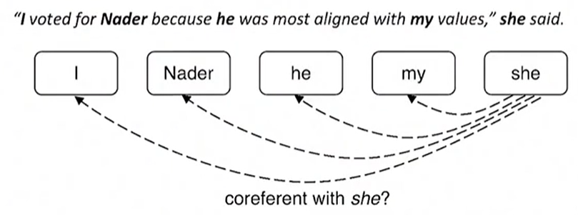

##### Mention Pair Training

​		Mention Pair Training训练的时候采用二分类的交叉熵代价函数，公式细节如下图所示：

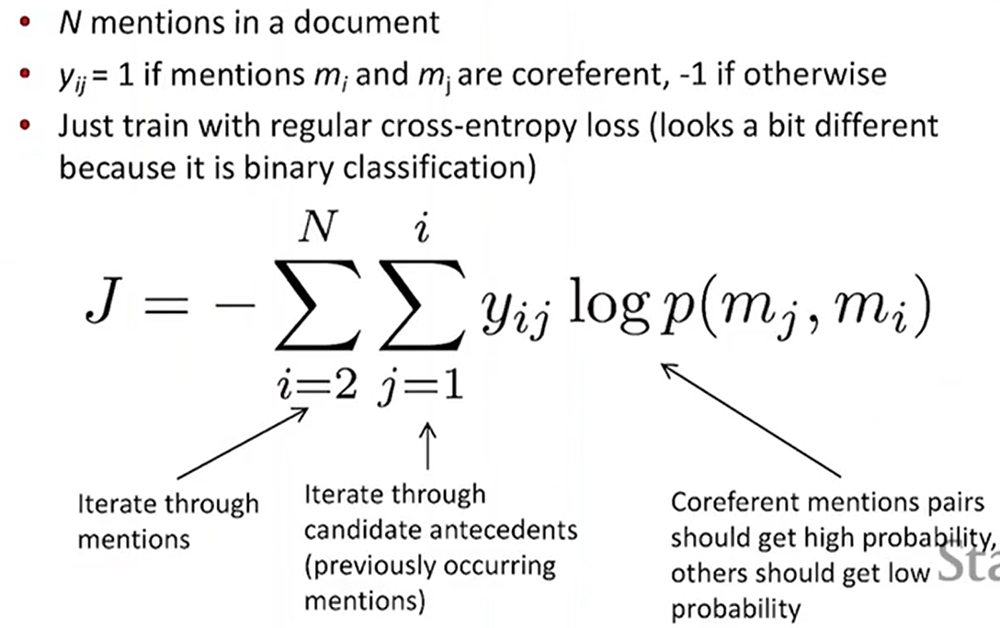

​		通过设定阈值，将阈值之上的相互的mention pair视为一个cluster，将mention pair转化为一个聚类问题。

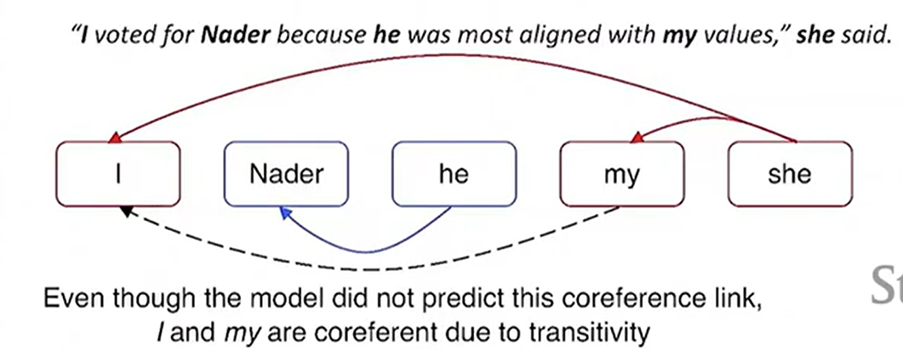

​		但是该方法还是存在一定的问题，一些相近的且明显的mention可能会干扰mention pair的产生，出现指代错误的情况。Mention Ranking则是对每一个metion pair进行一个打分，根据score的大小确定最合适的coreference。为例保证程序的统一性，加了一个N/A项，给singleton和first metion也是其配成metion对。

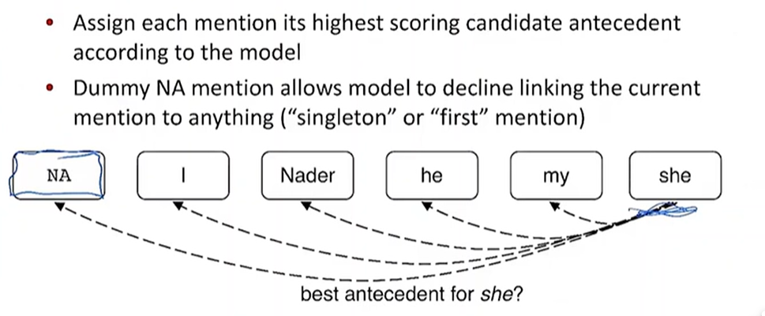

进行打分时，应用了softmax函数，使打分和为1，最后选取得分最高的作为correference link。
