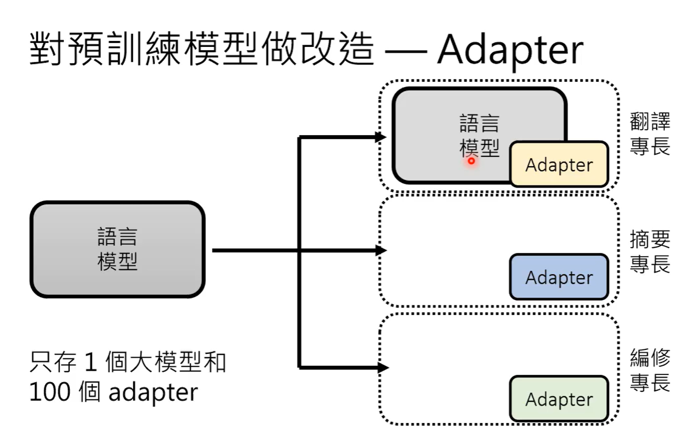

## Pre-train（预训练，or自督导式学习、基石模型）

​		ChatGPT（Generative Pre-trained Transformer）本质上还是一个语言模型（是经过一定预训练的语言模型，然后再做一些微调或者prompt？），但是需要一个关键技术——无痛制造成对资料（从网络上查找资料来进行训练）（但是存在一个问题，回答不一定都是对的，可能存在GPT自己编造答案的情况，因此需要人工评价来督导式学习。另外还有如何让ChatGPT精准回答（需要Prompting）、更正错误（预训练资料有限）、如何检测AI生成等问题）。

​		生成式学习的两者策略：各个击破（类似Seq2Seq的Decoding，一次生成一部分）、一次到位（一次生成全部，可以规定输出的规模，文本中END后的直接全部丢弃，或者由模型的一部分输出一个规模参数来决定），文本（token组成，一般各个击破）、影像（像素组成，一般是一次到位），语音（16K取样频率，每秒16000个取样点，产生音频的话可以先对文本进行各个击破，用较少的中间output作为input一次到位，生成音频）此外还可以N次到位，逐步生成。

## Finetune（微调）和Prompting（催眠，对多功能的AI模型提出要求，使其能够回答满足特定需求）

​		GPT是根据输入一步步生成的，BERT是对缺失的部分进行生成。

​		BERT如何成为通才——外挂（Head，加上一些额外的model）和微调（Finetune，）Adapter（pre-train好的语言模型不需要再进行微调，而只对增加的Adapter进行，从而让一个语言模型满足多种需求）

##### In-context Learning（根据范例来进行学习）

​		但是In-context Learning存在一些问题，因为语言模型自身在预训练后存在一定的能力，所以对范例有一定的了解，范例只是起到启动作用，因此需要模型够大才能对范例进行正确的学习（小模型就存在这样的问题，即使范例错误或者不相关，但是testing部分还是比无范例的更好）

##### Instruction-tuning（对语言模型进行微调，学习In-context Learning）

​		训练的时候给出一部分指令，让机器做对应的事情，然后在测试的时候给出未知的指令，让机器能够识别出并给出满足要求的答案（也即是让机器能够明白给出指令的意思，并作出对应的回答）。

​		另外Instruction-tuning也是一个让大模型在缺失大资料和运算资源的情况下，快速提升正确率的方法。

##### Chain of Thought（CoT） Prompting

​		CoT是给机器一些新定义的概念时，给出推论过程，让其理解到这个新定义（比如说让e = 11，一般情况下，机器会根据自己曾经学到的东西，认为e = 2.71...，需要给出推论过程才能理解e的新值）

​		另外还有Zero-shot CoT，不给例子让他自己进行推论。

​		Least-to-most prompting，部分数学问题太难了，可以将这个数学问题进行拆解。

​		soft Prompt，指令通过向量的方式进行输入，这个输入看成模型的一部分，和模型一起更新，类似Adapter。

## 大模型+大资料

##### Emergent

​		当模型大到一定的规模后，对任务的理解会突然出现，开始能够完成这些任务（突然开悟）。

##### Calibration

​		模型大到一定程度后也会对自身产生的答案抱有一定信心，正确的概率越大，信心越大。

​		并且还需要对资料进行一定的处理。

​		除去资料量与模型匹配，想要在资料量、运算资源较少的情况下得到更好的正确率，可以采用Instruction-tuning、Human Teaching等方法。

##### KNN LM

​		KNN LM相较于一般的语言模型，比如说transformer来说，最终的输出只有一个向量Representation，而不是逐步输出一个一个字的向量。具体计算时，他会把training过程中的input得到的Representation和testing的input得到的Representation计算一个相似度，选择其中距离最小的与Targets组队，最后经过一系列的转化，得出最后的output。

​		（但是现在一般还是需要和一般的语言模型进行联动，将两者的结果进行一个加权平均，才能得到更好的最终结果。另外计算距离的步骤很花时间。）

