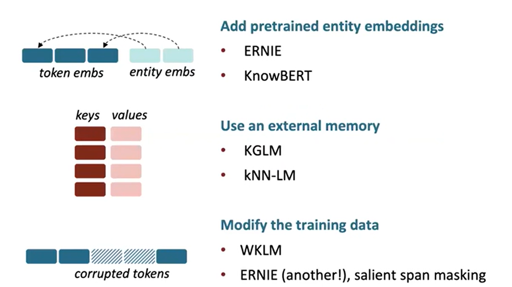
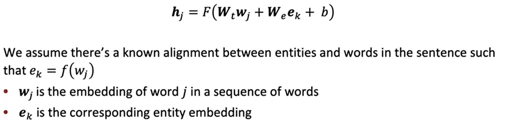
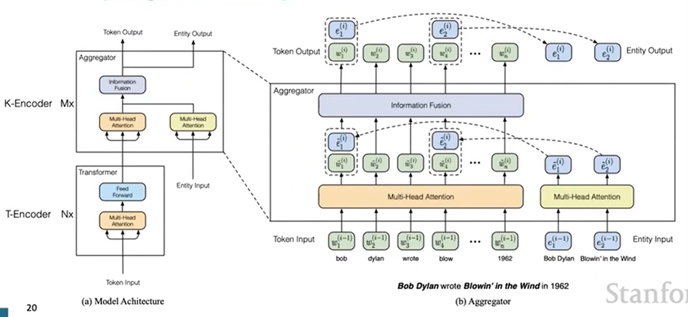
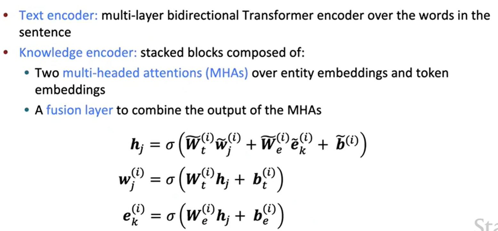
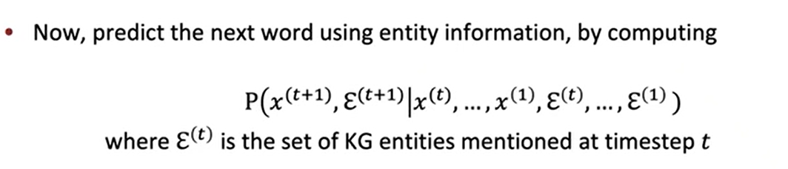
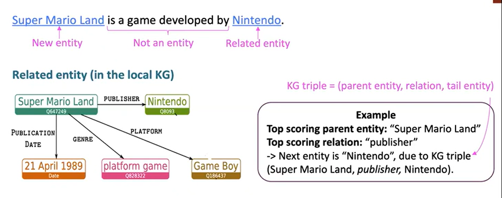
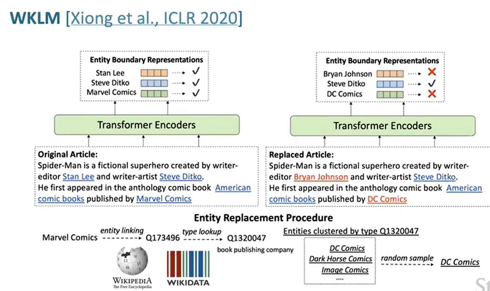

## Add knowledge to LM

​		在进行文字/词的预测时，因为学习的不够，或者学习到了知识但因为部分意思的差异，导致语言模型的输出结果并不一定准确，以及为了以后能够开发一个以语言模型为基础开发的数据库，这也需要查询的结果准确、可信、并且语言模型真的能够理解这些知识等，因此需要进行一定的优化。

​		Add knowledge to LM包括三种类别，如下图所示：

#### Add pretrained entity embedding

​		预训练过程中是没有具体的实体的概念，也即是几种表示美国的单词之间是没有关系的，pretrained embedding即是在预训练过程中添加实体embedding的概念，让语言模型一定程度上的了解这方面的知识——entity linking（类似Coreference Resolution的概念？）

​		现目前的entity bedding主要有Knowledge graph bedding（TransE）、Word-entity co-occurrence（Wikipedia2Vec）、Transformer的encoding部分（BLINK）

​		如果出现了多个语言模型的实体嵌入空间，则需要在模型中间加入一个融合层（fusion layer），来实现不同实体嵌入的结合。

#### ERNIE（Enhanced Language Representation with Informative Entities)

​		ERNIE是使用信息实体的方式增强语言表示，包含有实体嵌入和融合层

​		

​		但是ERNIE也存在一些问题，需要对文本数据进行实体的标注，另外对语言模型也需要进行进一步的预训练。

​		另外在BERT模型中，还有将实体训练后集成的entity linker作为BERT的扩展的方法，并在损失函数中将entity linker添加进去，

#### Use an external memory

​		external memory是一种通过外部存储来记录实体连接（知识图谱），提供给模型访问，模型不需要再通过预训练来知道这些知识，不会改变模型参数，可以实时的更新知识（？）

Knowledge-Graphs for Fact-Aware Language Modeling（KGLM）

​		KGLM是通过建立一个知识图，来表示实体之间的关系，进行文本预测时不再是通过上下文，还有实体关系。预测关系实体时主要是寻找得分最高的父实体以及它对应的知识图中得分最高的关系、预测新实体则是从知识图中找到得分最高的实体。（无实体则只预测文本）

​		另外还有KNN-LM的方法（此前已经在week7学过了）

#### Modify the training data

​		Modify the training data是通过屏蔽数据，然后让模型通过事实知识找出哪些数据被掩盖了。

Weakly Supervised Knowledge-Pretrained Language Model（WKLM）

​		该模型就是训练模型识别知识的真假，通过替换文本中的实体的方法来制造一部分假知识，然后让模型预测实体是否被替换等。

#### Evaluating knowledge in LMs

​		LAnguage Model Analysis（LAMA）Probe用于测试模型里学习到了多少知识，该方法主要依据知识图和问题-答案对等，使用它自己的一套封闭是标准进行测试（测试模型预测句子中确实的Token（文本 or 更细分的单词）的能力）。