## 模型压缩

​		因为端设备存在资源的限制，以及深度神经网络模型存在冗余等原因，因此可以使用剪枝、蒸馏、量化等方法进行模型压缩，减小模型规模。

### 剪枝 Prune

​		过参数化主要是指在训练阶段，在数学上需要进行大量的微分求解，以此捕捉数据中的微小变化信息，一旦完成迭代式的训练之后，网络模型在推理的时候就不需要这么多参数。剪枝就是基于过参数化的理论基础提出的。剪枝算法的核心思想是减少网络模型中参数量和计算量，同时尽量保证模型的性能不受影响。

​		剪枝的方法主要有三种：

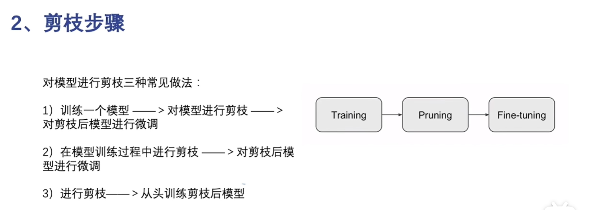

​		第一种预训练之后再进行剪枝使用的最多（微调阶段主要是恢复被剪枝操作影响的模型表达能力）。

​		剪枝之前需要通过设定裁剪阈值或者比例来确定剪枝层（加入一个与参数矩阵一致的mask矩阵，通过矩阵中的0、1来进行剪枝）

​		结构化剪枝对模型结构进行调整，是有规律的、有顺序的进行剪枝，不影响参数（未被剪枝的参数还是继续加入到训练过程中，被剪枝的参数不再参与训练）。

​		非结构化剪枝则是随机选取层级、通道等进行剪枝。（剪枝的方法可以预定义一个阈值，低于这个阈值的权重则被剪去，高于的则被保留，但是存在很多问题，会可能会剪去一些需要的信息；另外则有一种拼接函数的方法）

​		静态剪枝在训练后和微调前进行剪枝，主要包括：剪枝参数的选择、剪枝的方法、选择性微调和再训练（这一步主要用于恢复模型性能，但是模型的部分层、通道已经被删除了，会影响部分性能）

​		动态剪枝则是在运行时（训练时）才决定暂时性剪去部分层、通道，（动态剪枝一般不会进行微调，因为训练过程中相当于已经进行了调整）

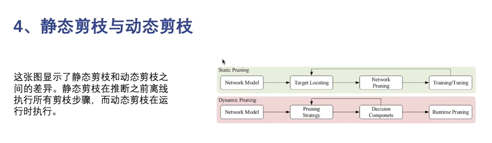

​		硬剪枝是在每个epoch之后将卷积核直接剪掉，被剪掉的卷积核会在下一个epoch中不再出现，但是存在模型性能降低和依赖预训练模型性能的问题。

​		软剪枝则是在epoch更替时将模型参数设置未0，不直接丢弃，在所有epoch执行完毕后才进行剪枝。

### 量化

​		量化是指将神经网络模型中的连续取值的权重或激活值近似为有限多个离散值的过程，用以减少浮点数运算，提升模型速度，压缩参数，降低内存占用，但是选取离散值会导致模型的精度下降。

​		主要有线性量化和非线性量化，线性量化是将参数按照比例进行离散化，相邻两个量化值之间的差距是固定的，非线性量化则是根据数据的分布特征进行量化，数据多的地方，量化间隔小、量化精度高，数据少的地方则相反（但是通用硬件加速比较困难）。

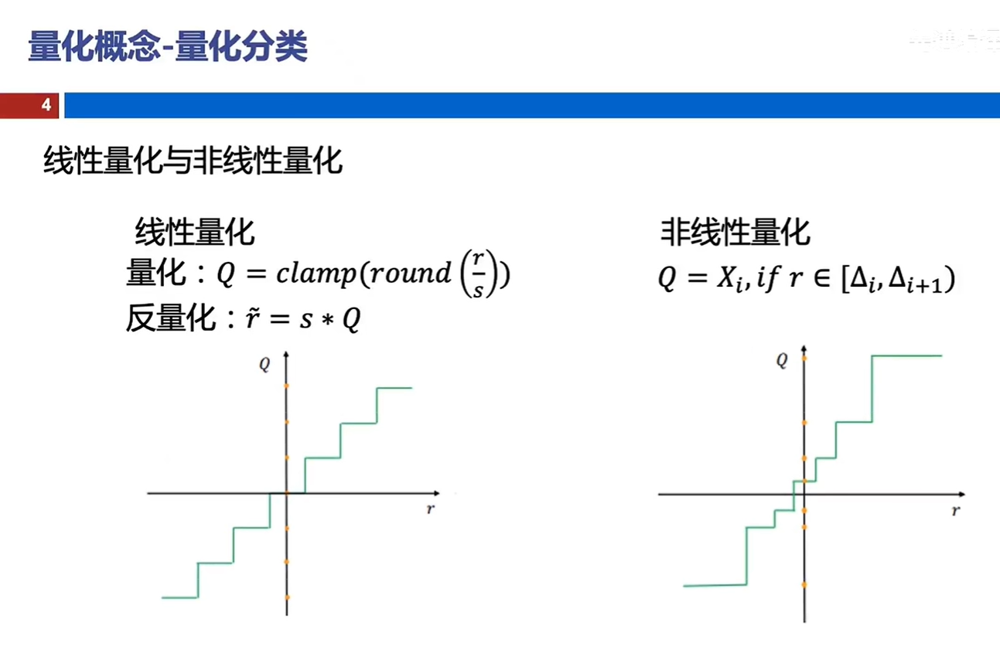

​		对称量化和非对称量化则是在线性量化的基础上，对量化的中心点进行修改。

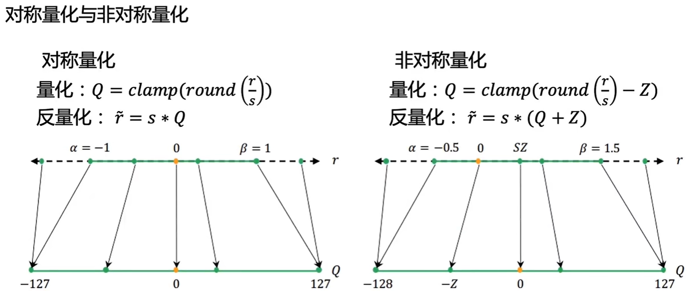

​		另外还可以根据量化的粒度和位宽将量化分为逐层量化、逐通道量化和统一精度、混合精度。

​		量化方式主要分为两类：训练后量化和量化感知训练

​		训练后量化在模型训练完成后进行量化，可以不需要微调过程，量化也可以不需要或者仅需一小部分数据来实现量化。（适用于数据敏感的应用场所）主要包括权重量化和全量化两种：

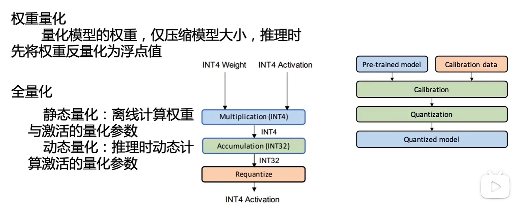

​		量化感知训练则是在训练好的模型上插入伪量化算子，对数值进行量化，以及反量化后，插入伪量化算子来模拟量化产生的误差，然后在训练集上更新权重，调整对应的量化参数，或者将量化参数作为可学习的参数在反向传播中更新。该量化方式一种传统的实现方法是使用straight-through estimator（STE），将伪量化算子的梯度设置为1，也即是输入梯度等于输出梯度。

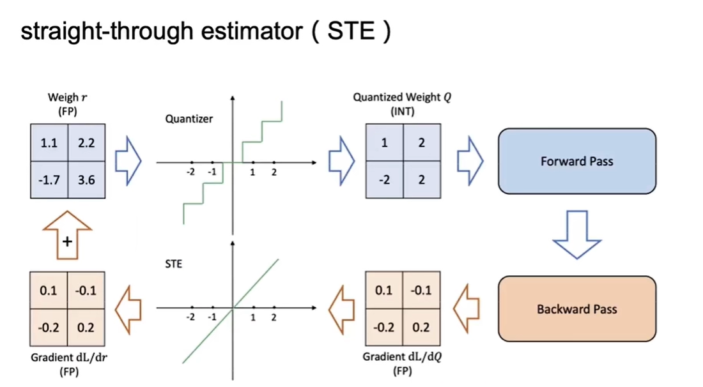

### 知识蒸馏

​		知识蒸馏是通过教师模型（训练好的复杂的模型）指导学生模型（规模较小的模型）训练，最后让学生模型学习到教师模型的知识，最终使学生模型达到或媲美老师模型的准确度。

​		教师模型的知识（蒸馏对象）主要包括：1、输出特征知识（用教师模型的输出，比如：一个分类用的向量等，来进行指导，相当于直接给学生更具体的答案，而不是仅对着唯一的正确答案进行训练）；2、中间特征知识（用中间层的输出来作为知识指导学生模型，相当于给出做题方法）；3、关系特征知识（用教师模型不同层和不同样本数据之间的关系来作为知识指导学生模型，学习不再限制于一层，而是参考多层的知识）；4、结构特征知识（结构特征知识则是对教师模型比较完整的知识体系进行学习，包括前面的三种知识，是较为全面的学习方法）

​		蒸馏的方法则包括：1、离线蒸馏（单向的知识迁移）；2、在线蒸馏（教师与学生一起学习，并且是线上的，教师模型和学生模型都是在训练的过程中）；3、自蒸馏（在线蒸馏的一种特殊情况，教师模型和学生模型都使用的一个模型，主要采取两种方法进行蒸馏：（1）是使用不同类型的数据进行互相蒸馏；（2）是网络层之间进行蒸馏，深层次的指导浅层次的）

​		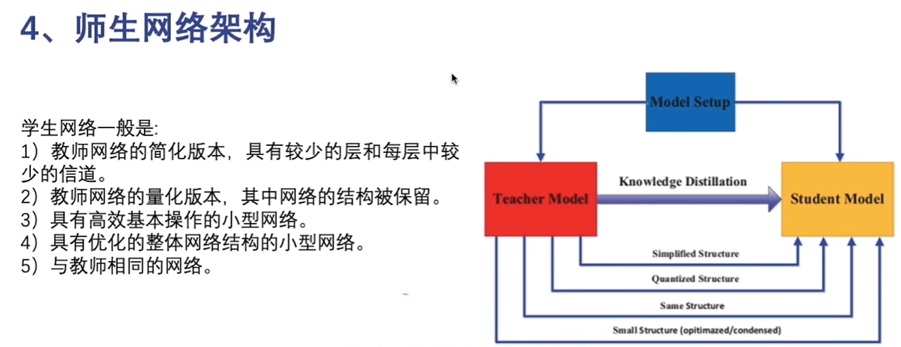

​		蒸馏算法：

​		1、对抗蒸馏：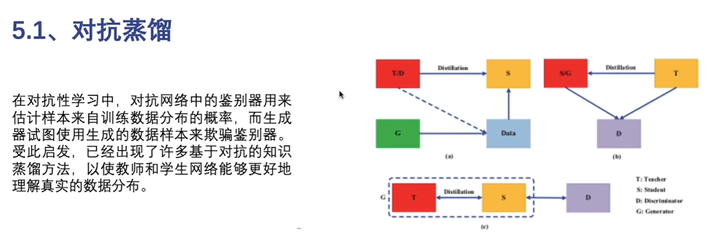

​		2、多教师蒸馏：

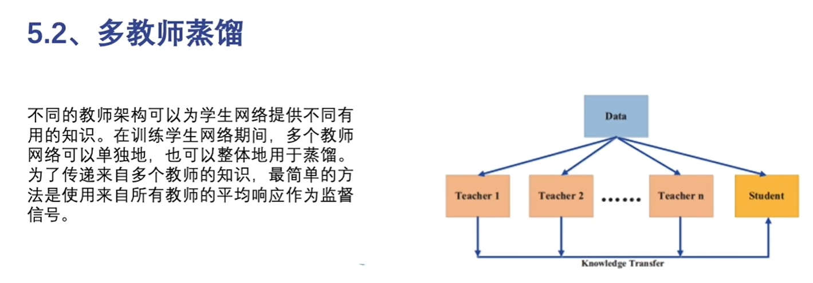

​		3、交叉模式蒸馏：

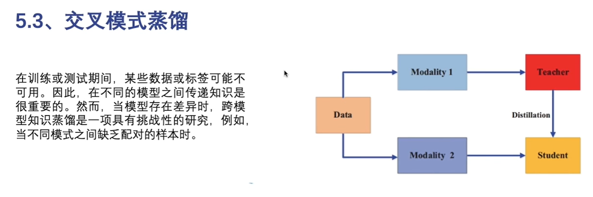

​		4、基于图形的蒸馏：

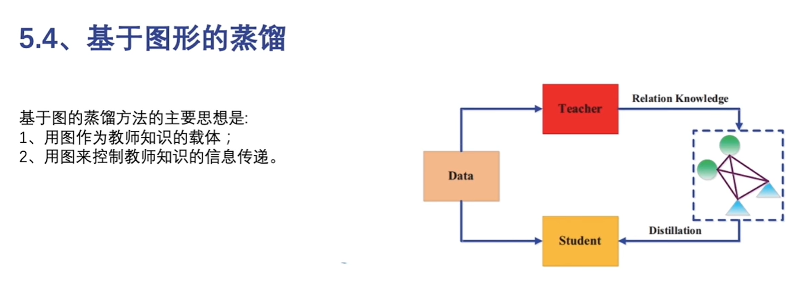

​		蒸馏流程：

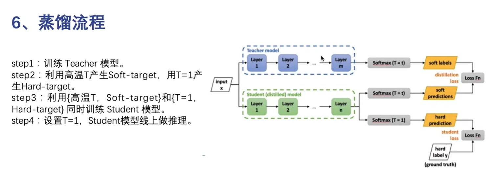

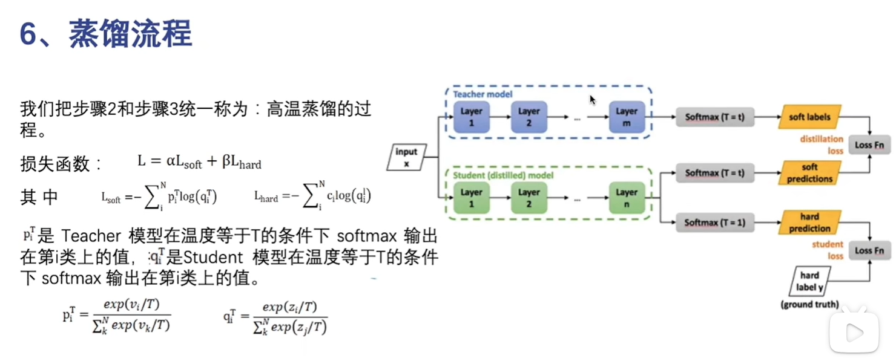